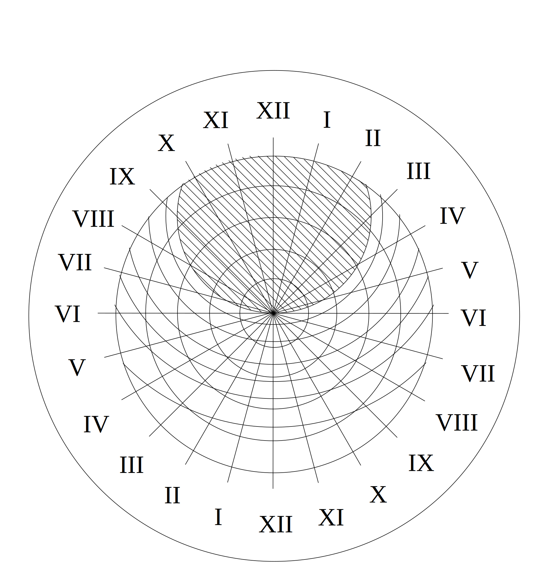

# Det underbara uret i Lund

En oavslutad längre text [ud.pdf](ud.pdf). Problemet med den är väl närmast att den inte passar någon av dess potentiella mågrupper...

Jag arbetade med detta under några år runt sekelskiftet 2000. Senaste revisionen då var i maj 2003 (enligt RCS log entries). Jag ansåg då att denna oavslutade längre text var skit. Jag är numera mindre säker på min sak, dock öppnar jag nu .byrålådan på glänt. Jag skäms inte längre för min text.

Där är intressant kod i projektet, för hanteringen av sidohuvuden på väster- respektive högersidor, kapitelhuvuden, och för ornament och andra typografiska finesser. Där är också kod som redigerar innehållet i eps-filer.

För att bygga dokumentet behöver du en massa extra saker som t ex fonten [yinit-as](https://ctan.org/pkg/yinit-as?lang=en). Noterar nu att den inte kommer med TeX längre. Jag har transformerat den till ett postscript typsnitt (aka font). Brödtexten är i Berling antikva, som är en kommersiell typsnitt jag köpt eftersom det är det enda välkända typsnittet från Lund. 

Texten är i ISO-8859-1, eftersom GNU troff fortfarande år 2000 hade shaky UTF-8 support. Anfangerna i yinit-as får inte ha märkliga diakritiska tecken (t ex inte vara å, ä eller ö).
